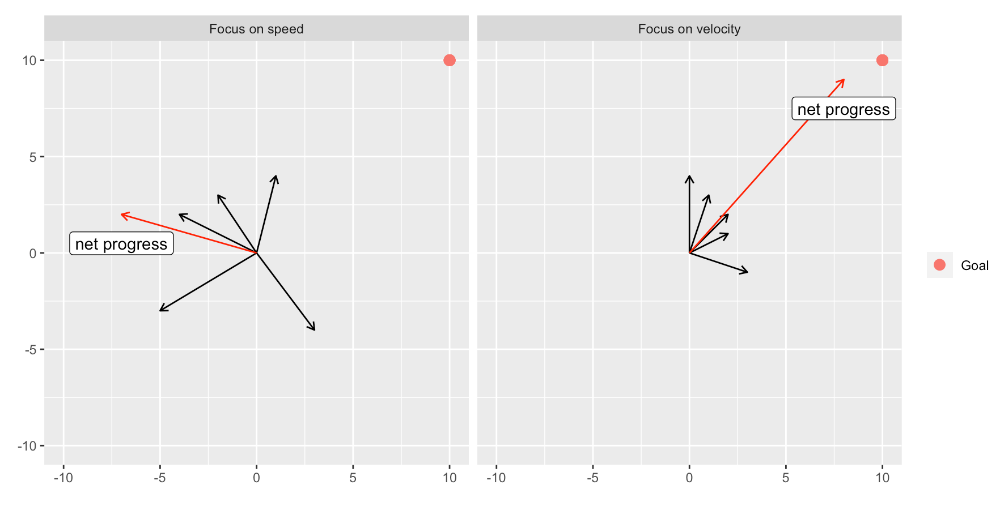
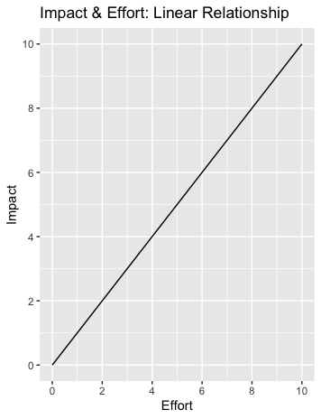
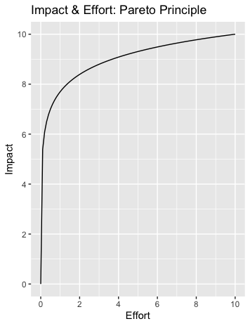
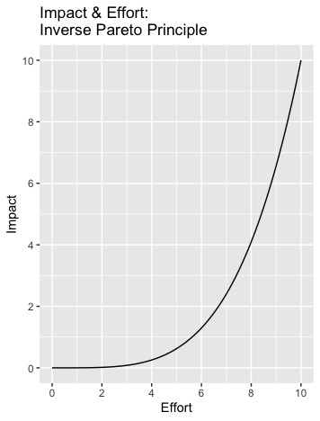
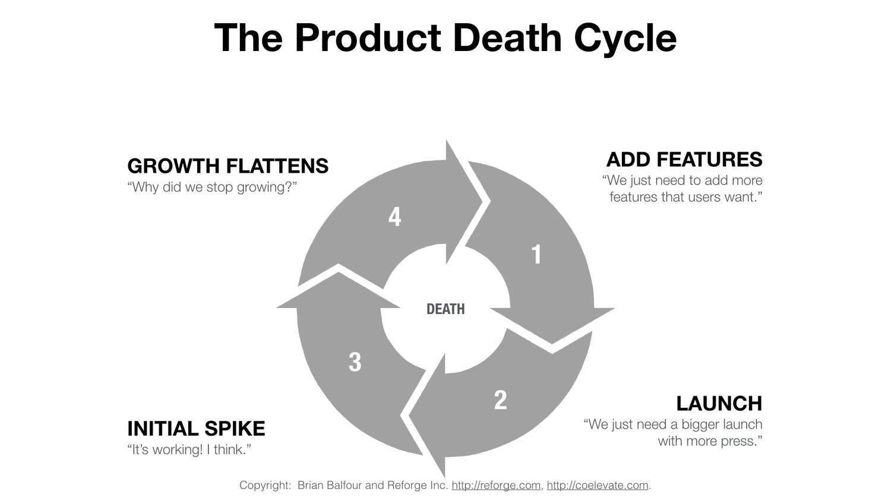
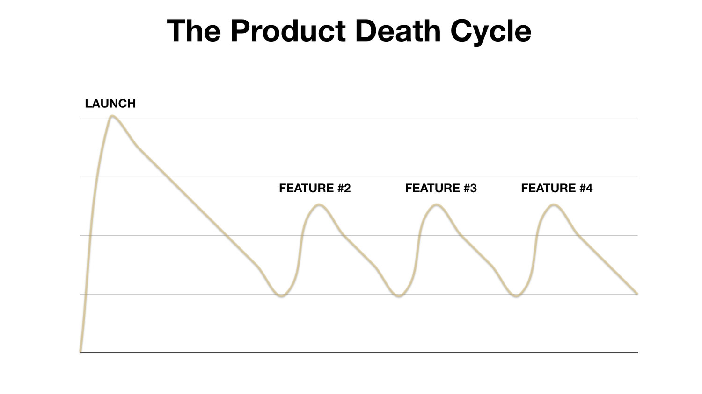

# Product management is a balancing act

#### 2020-11-14

As a PM, you’re constantly finding tradeoffs. How do we balance value creation with value extraction? Short-term goals versus long-term goals? There are [so many of these types of questions](https://productcoalition.com/paradoxes-of-product-management-47485df421ac). In product management, balance is everything. To find balance, it takes focus, presence, and practice.

Balance requires awareness of what is on either side of the scale. I find myself constantly asking questions like “On the spectrum from X to Y, where do we want to be?” For example, imagine you are building a new feature. One of the balances you might want to strike is the eternal “MVP” debate:

But so often dichotomies don’t exist; you are never really only balancing just one thing, and it often isn’t the case that you must choose one at the expense of the other. For example, if we are trying to balance business needs vs user needs, maybe a spectrum is the wrong mental model to use (a lot of people use a Venn diagram for this). Ideally, we want to create opportunities that are good for users and good for the business. If we add a second dimension, our “spectrums” becomes chords on a circle:

Each of the balances you try to strike as a PM doesn’t happen in isolation—they interact with each other. Add a third dimension, and now instead of a 1-dimensional spectrum, we’re thinking about balance as coordinates on a sphere:

The final complication I can even imagine visualizing here is a fourth dimension: these balances don’t only interact with each other, they evolve and change over time. Business needs and user needs are constantly evolving, after all. Now, instead of visualizing “balance” as coordinates on a sphere, we are also considering how those balances change over time:

Balance is important. Recognizing what you are balancing is important. And in my opinion, a linear spectrum doesn’t always paint a complete picture when trying to describe what you are balancing.

# The commodification of attention

#### 2020-10-01

Commodification can only occur in a marketplace that has already been standardized and abstracted. Tim Hwang, who formerly worked on public policy at Google, explains this using the example of Chicago grain markets: at first, farmers traveled to the market and sold their grain in person. With the rise of railroads, more grain was coming into the city’s markets than merchants could haggle over with each individual farmer. Additionally, there may have been many farmers all contributing grain that ended up on a single car on the train, at which point it was impossible to tell which farmer the grain belonged to.

To solve this problem, the grain markets took the first step towards commodification: standardization. The Chicago Board of Trade developed specific metrics to grade each category of grain. Merchants no longer needed to know the farmer that the grain came from; the system of standards assured the level of quality.

The next step toward commodification is abstraction. Now that merchants only needed to know the grade and quantity of the grain they are buying, there was no interaction with the farmers. Merchants who may not have any expertise about grain could now buy and sell quantities of grain effectively. The receipts for the quantity and grade of grain were the things being bought and sold, not the grain itself. Grain was now a commodity because the market had been standardized and then abstracted.

Tim Hwang argues the same process has happened in the marketplace for attention. The Interactive Advertising Bureau has created standards for internet advertisements much like much like the Chicago Board of Trade had standardized grain quality. Although attention is certainly less concrete than train cars of grain, the internet has provided the data and tools to measure the amount of interaction and attention each ad receives. As the technology matured, the marketplaces for buying and selling online advertisements have become more abstract. Ads are surfaced on the internet algorithmically and buyers are far removed from the users consuming the ads and often the individual products or sites where the ads appear. Your attention is a commodity.

_From [Subprime Attention Crisis](https://www.amazon.com/Subprime-Attention-Crisis-Advertising-Originals/dp/0374538654)_

# Carcinisation

#### 2020-09-01

Crustaceans will always evolve into crabs. They’re all on their evolutionary journey to their final form: crabs. There’s a weird corner of the internet that is really into this topic right now.

_From [Wikipedia](https://en.wikipedia.org/wiki/Carcinisation)_

# Speed vs velocity

#### 2020-09-25

How do you measure your success as a product manager? In my experience, “speed” is one of the most common ways—in fact, someone I know was fired for being “too slow to ship.” Yes, you can’t create value if you don’t ship anything, but more often than not, speed isn’t the issue. In fact, evaluating PMs for how “fast” their team moves can have pretty negative side effects.

Instead of speed, we should think about velocity. Velocity has speed _and_ direction. “How fast are we moving _in a certain direction?” _is a much better way to evaluate the pace of a product team. Moving fast with no direction won’t result in success. Most products don’t fail because they didn’t move fast enough; they fail because they built the wrong thing.

“If you go speedily in the wrong direction, you will end up in the wrong place.”

In the plot above, each of the vectors represents a project or feature. The magnitude of the vectors could be considered “speed”: it is how quickly / how much progress was made towards that particular feature’s goals and KPIs. Even though the plot on the right has smaller magnitudes (i.e. less “speed”), the net effect is much closer to the goal. Direction matters. It shouldn’t be surprising that shipping features willy-nilly without a clear product direction won’t result in success, but even so, it seems pretty common for teams to obsess about speed.

I joined a team that had almost exclusively focused on speed. Before I joined, they tried a lot of different things in a short period of time and they were able to launch new features at a record setting pace. But it was not clear _why_ their product existed. There was no vision for where the product was headed, there wasn’t suitable analytics in place, the deployment CI/CD pipeline was a mess, there were A/B tests left running in various states… There were some big changes we needed to make to make sure we could provide value to our customers and our business. But when the team was lauded for their speed and encouraged to “move faster”, there was no incentive to slow down and focus on the things that mattered most.

_From [@shreyas](https://twitter.com/shreyas/status/1309708343963865088)_

# Impact and effort

For a given project, we often assume that there is a linear relationship between the amount of effort (or time) we put in and the amount of impact we get out. “The more time we spend on this feature, the more impactful it will be,” we might tell ourselves.

But this is rarely—if ever— the case. Many projects follow the [Pareto principle](https://en.wikipedia.org/wiki/Pareto_principle): 80% of the impact comes from 20% of the effort. This is often the case in the earlier stages of product maturity: just _having_ a feature is the most impactful thing you can do; polishing and tuning that feature will only have small incremental effects.

But there is another case: the inverse Pareto principle, where there is an exponential relationship between impact and effort. Some examples where this can happen are:

*   When an initial feature simply doesn’t work on its own because it is meant to work in concert with other, not yet developed features;
*   When you’re in an all-or-nothing situation. One of these all-or-nothing scenarios is fixing data quality issues: there is _no_ value in your data analytics ecosystem if the data is only accurate some of the time.

If you are exclusively focused on speed, projects that have this type of curve can be dangerous. If you only build features that are easy to implement, you might be skipping the most impactful work.

Thinking about these curves is also important when scoping a project. You certainly don’t want to end up building an MVP that simply isn’t impactful.

# The product death cycle

#### 2020-07-01

This is a scary and powerful way to describe a product development pattern that I’ve seen first hand. There’s a lot of different scenarios to illustrate this concept—Shreyas Doshi outlines a good one [here](https://twitter.com/shreyas/status/1309708395067240448?s=20)—but this is one recent example I’ve heard:

1. We have an idea for a feature—or sometimes the executive team has an idea for a feature.
2. We do some user research. We propose our solution to a few clients. We show them the shiny new prototypes. They like them.
3. We report back to the executive team: “Users like the feature!”
4. The feature is greenlit and implementation begins.
5. The feature launches. It is rarely used and has little effect.
6. We’ve come this far and we still think the feature could work, so we restart the whole cycle and do more iterations on the feature. Time goes by and we have accomplished nothing.

This is what the cycle looks like:

If you zoom in on the lifecycle of a single feature, here is what the cycle looks like. The X axis is time and the Y axis is whichever KPI was chosen for the particular feature:

This is closely related to [the speed vs velocity concept](https://anthonywbaker.com/ideas#speed-vs-velocity): often, the most dangerous thing a product team can do is head in the wrong direction or build the wrong thing.

Some red flags that could be early indicators you’re heading toward (or already in) the death cycle:

*   Your company starts having a larger and larger focus on “go to market”—even within the product org.
*   There is a high emphasis placed on features. People talk about the business in terms of features, not problems. Everyone is highly solution-oriented, not problem-oriented.
*   The people selling the product don’t feel confident that new features are going to help them.

The product death cycle is insidious: it takes a long time for the symptoms to manifest, which means it is difficult and slow to diagnose.

If you think you’re in it, how do you get out of the product death cycle? A big part is being aware of your own biases. If you can carefully distinguish things that you assume from things that you know, you are a lot less likely to fall into the product death cycle.

Part of this means walking the walk of user centric design, not just talking the talk. Deeply understanding a user need is a lot different than determining if a user “likes” a certain feature. User research is hard.

Another way to avoid sinking into this downward spiral is to make sure you are leveraging multiple frameworks. Does your product have [the four fits](https://anthonywbaker.com/ideas#productmarketmodelchannel-fit)? Does it have [traction](https://www.amazon.com/Traction-Startup-Achieve-Explosive-Customer/dp/0241242533/ref=sr_1_4)? Is it loved by some core audience? If you can leverage multiple different tools or thought frameworks and your feature seems to pass the test for each of them, you’re probably on the right path.

_From [Brian Balfour](https://brianbalfour.com/essays/product-market-fit-isnt-enough)_

# The trap of big deals

#### 2020-04-01

For B2B startups—or startups transitioning to B2B, as was my experience—this will undoubtedly happen: The Big Deal™️ will come along, and unfortunately, you wont close it because you are missing a certain feature or certification. Naturally, it will be tempting to build that feature or spend time and money to get certified.

But the trap of big deals is the concept that in a resource-constrained environment (like most startups), you shouldn't spend your resources building those features or going after that certification _unless_ your business is predicated on big deals. If you're the type of SaaS company that makes most of its revenue from small deals, you need to take them into account when choosing how to prioritize projects—which seems obvious. But it isn’t always so obvious to deprioritize a feature you know a big, potential client wants.

If you consistently prioritize work that you believe will help you close big deals and neglect projects designed to help smaller customers use your product, you'll end up building a product that isn't working for your core audience.

_Inspired [this post](https://medium.com/@gokulrajaram/self-serve-first-the-overlooked-but-essential-paradigm-underlying-great-software-companies-45a67dbec4c4)_

# The cargo cult and “bending over backwards”

#### 2019-11-01

I first heard of this concept when [Dave Robinson](https://twitter.com/drob) pointed me to Richard Feynman’s 1974 [commencement speech](http://calteches.library.caltech.edu/51/2/CargoCult.htm) at Caltech. Good scientists “bend over backward” to compile all of the evidence _against_ the hypothesis they are trying to prove, as well as evidence for it. Feynman’s speech is a good reminder to question both the macro idea—how do we _know?_—and the micro: how do I know _this particular thing_ is true? We should always be on the lookout for pseudoscience.

# Managing up

#### 2020-04-01

[Jared Silver](https://twitter.com/JaredSilver) introduced this one to me, and the concept immediately clicked. I worked at a company with a lot of first-time managers and a fairly flat organizational structure. If you’ve got a lot of critical thinkers whose work has them interact with different teams across the company, it is inevitable that those people will identify problems or solutions that their managers may not see. There will be times when you have to work together with your manager to accomplish things out of the scope of your own job, and “managing up” is a framework (that a lot of people have written about) to help you do just that.

_Inspired by [this post](https://larahogan.me/blog/how-to-manage-up/)_

# Conway’s law

#### 2020-01-01

“Any organization that designs a system (defined broadly) will produce a design whose structure is a copy of the organization's communication structure.”

	—[Melvin Conway](https://en.wikipedia.org/wiki/Conway%27s_law)

# SaaS retention as an indicator of P/M fit

#### 2016-09-01

I came across this idea from [Brian Balfour’s](https://brianbalfour.com/) [Reforge program](https://brianbalfour.com/courses). How can you tell if your product is providing value to the market, aka that you’ve found the infamous “product market fit?” One way is to look at your retention curves. You expect to see some early dropoff; not everyone you market to is your core audience. But if your curve flattens out, you have some powerful evidence that there is a market out there that is unlocking enough value from your product to keep coming back. If the curve doesn’t flatten out? Time to keep iterating on solving a deep-seated need for your users.

_Inspired by [this post](https://brianbalfour.com/essays/product-market-fit)_

# Product/Market/Model/Channel fit

#### 2019-01-01

Another one from Brian Balfour and the good people of the [Reforge program](https://brianbalfour.com/courses). In essence: product-market fit isn’t enough. Product-market fit alone could lead you into the “if you build it, they will come” fallacy. Does your product solve a need _well? _Is that need important enough that your users “can’t live without it?” Is there a significant group of people who have that need? If so you’ve found product-market fit.

But it goes on: do you have a monetization model that makes sense for your product and your market? Do you have a viable channel for new users to find your product? If so, you’ve found product-market-model-channel fit. A business will fail if it doesn’t find all of these “fits.”

# Premortems

#### 2019-05-01

[Jared Silver](https://twitter.com/JaredSilver) introduced this to our team. A premortem is a great way to get the gears turning to make sure you’ve considered all options before making a big decision. It goes like this: Imagine you and your team get called into your boss’ office in a few months because the project you’ve been working on has become a total disaster (for a more extreme version: imagine you are all getting fired). What could have gone wrong? It’s a fun twist on the classic pro/cons list, and works best when choosing between two potential options.

# The wheel of value creation

#### 2019-12-01

I heard of this one from [Weston Stearns](https://www.linkedin.com/in/weston-stearns/). He presented this at a company all-hands at a time when focus on solving our users’ needs had taken a backseat. In essence, a company needs to balance three focuses: first, creating as much value for our users as possible; second, monetizing that value; and finally, investing that money to create even more value. It’s all about finding balance within the wheel of value creation. The wheel of value creation in the sky keeps turning.

# Machine learning as translation into N-dimensional space

#### 2018-10-01

This is a mile-high, extremely oversimplified view of machine learning, but this idea helped a lot of various machine learning approaches click for me.

You start with very complicated data. You need to distill it down so you can plot it in space. There are all sorts of techniques to do this distillation. Once you can plot your data, you can do all sorts of math magic. There are lots of different types of math magic. The math magic lets you calculate distances between points and find clusters. Voila!

# Designing for accessibility

#### 2020-04-01

Designing for accessibility isn’t just the right thing to do, it’s a key part of designing great solutions. Accessible solutions benefit everyone. Take curb cutaways: the ramps at the edges of sidewalks originally designed for people in wheelchairs benefit other people too, like moms pushing strollers or delivery people pushing carts. The company OXO started out designing utensils and appliances for senior citizens and people with Arthritis, and ended up making easy-to-use tools that work great for everyone. Designing a mobile app that works great on 3G connections will be lightning fast for someone on LTE or 5G. Designing for your users with the most requirements can help create even better solutions for everyone.

_Inspired by_ [Change by Design](https://www.amazon.com/Change-Design-Transforms-Organizations-Innovation/dp/0061766089) _and_ [User Friendly: How the Hidden Rules of Design Are Changing the Way We Live, Work, and Play](https://www.amazon.com/User-Friendly-Hidden-Design-Changing/dp/0374279756)

# The value of process

#### 2020-09-12

Whatever outcome you are after, a good process makes it repeatable, scalable, and more likely. Processes work in two directions: good processes can make good outcomes more likely and bad outcomes less likely. For example, a good process for product development involves systematically evaluating the impact of your product on your target market, making it more likely your new features / products will be successful. A good process for deploying code involves unit testing and end-to-end testing to make it less likely you’ll release bugs.

When something bad does happen, it is often more important to look at _what in the process_ allowed that thing to happen rather than just investigating _what_ bad thing happened. For example, recently my team shipped some code that caused a crash. The particular mistake was identified, but we also identified a flaw in our testing process. We’re now more likely to ship crash-free code because of the additional focus on process. We didn’t fix a bug, we made it more likely bugs won’t be shipped in the future. That’s the power of process: making desired outcomes more repeatable.

I am a strong believer in strong processes, but how much is too much? It’s easy to over-engineer processes that ultimately slow the team down. Two useful tools for finding balance are 1. the rule of threes (if something happens three times, it’s worth spending more time on improving relevant processes) and 2. considering the [cost of quality](https://anthonywbaker.com/ideas/#cost-of-quality).

# Cost of quality

#### 2019-02-01

The goal of almost any product team is to move as fast as possible _and_ build a quality product. The “cost of quality” cuts two ways: there can be a cost of shipping something that is low quality, and there can be a cost to shipping something that is high quality.

The cost of shipping a low-quality product is degraded user experience (imagine bad reviews, lost customers, etc). But the cost of shipping a high-quality product is a decrease in your team’s speed.

Time is valuable, and spending too much of it polishing features or conducting extensive QA takes time, especially when the Pareto principle comes into play (the last 20% of the work could take 80% of the time). What is the cost of the chance of a few small bugs? What is the cost of starting the next team project a week later?

The cost of quality is yet another area that requires [finding balance](https://anthonywbaker.com/ideas/#product-management-is-a-balancing-act).
