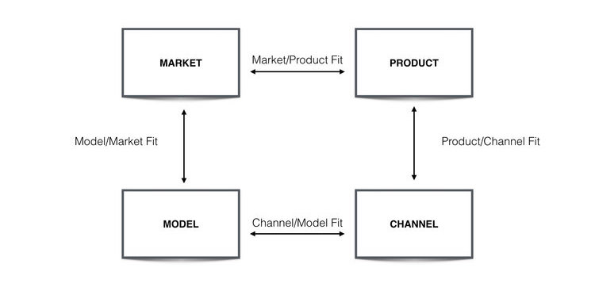

# The trap of big deals

#### 2020-04-01

For B2B startups—or startups transitioning to B2B, as was my experience—this will undoubtedly happen: The Big Deal™️ will come along, and unfortunately, you wont close it because you are missing a certain feature or certification. Naturally, it will be tempting to build that feature or spend time and money to get certified.

But the trap of big deals is the concept that in a resource-constrained environment (like most startups), you shouldn't spend your resources building those features or going after that certification _unless_ your business is predicated on big deals. If you're the type of SaaS company that makes most of its revenue from small deals, you need to take them into account when choosing how to prioritize projects—which seems obvious. But it isn’t always so obvious to deprioritize a feature you know a big, potential client wants.

If you consistently prioritize work that you believe will help you close big deals and neglect projects designed to help smaller customers use your product, you'll end up building a product that isn't working for your core audience.

_Inspired [this post](https://medium.com/@gokulrajaram/self-serve-first-the-overlooked-but-essential-paradigm-underlying-great-software-companies-45a67dbec4c4)_

# The cargo cult and “bending over backwards”

#### 2019-11-01

I first heard of this concept when [Dave Robinson](https://twitter.com/drob) pointed me to Richard Feynman’s 1974 [commencement speech](http://calteches.library.caltech.edu/51/2/CargoCult.htm) at Caltech. Good scientists “bend over backward” to compile all of the evidence _against_ the hypothesis they are trying to prove, as well as evidence for it. Feynman’s speech is a good reminder to question both the macro idea—how do we _know?_—and the micro: how do I know _this particular thing_ is true? We should always be on the lookout for pseudoscience.

# Managing up

#### 2020-04-01

[Jared Silver](https://twitter.com/JaredSilver) introduced this one to me, and the concept immediately clicked. I worked at a company with a lot of first-time managers and a fairly flat organizational structure. If you’ve got a lot of critical thinkers whose work has them interact with different teams across the company, it is inevitable that those people will identify problems or solutions that their managers may not see. There will be times when you have to work together with your manager to accomplish things out of the scope of your own job, and “managing up” is a framework (that a lot of people have written about) to help you do just that.

_Inspired by [this post](https://larahogan.me/blog/how-to-manage-up/)_

# Conway’s law

“Any organization that designs a system (defined broadly) will produce a design whose structure is a copy of the organization's communication structure.”

	—Melvin Conway

# SaaS retention as an indicator of P/M fit

#### 2016-09-01

I came across this idea from [Brian Balfour’s](https://brianbalfour.com/) [Reforge program](https://brianbalfour.com/courses). How can you tell if your product is providing value to the market, aka that you’ve found the infamous “product market fit?” One way is to look at your retention curves. You expect to see some early dropoff; not everyone you market to is your core audience. But if your curve flattens out, you have some powerful evidence that there is a market out there that is unlocking enough value from your product to keep coming back. If the curve doesn’t flatten out? Time to keep iterating on solving a deep-seated need for your users.

_Inspired by [this post](https://brianbalfour.com/essays/product-market-fit)_

# Product/Market/Model/Channel fit

Another one from Brian Balfour and the good people of the [Reforge program](https://brianbalfour.com/courses). In essence: product-market fit isn’t enough. Product-market fit alone could lead you into the “if you build it, they will come” fallacy. Does your product solve a need _well?_ Is that need important enough that your users “can’t live without it?” Is there a significant group of people who have that need? If so you’ve found product-market fit.

But it goes on: do you have a monetization model that makes sense for your product and your market? Do you have a viable channel for new users to find your product? If so, you’ve found product-market-model-channel fit. A business will fail if it doesn’t find all of these “fits.”

# Premortems

[Jared Silver](https://twitter.com/JaredSilver) introduced this to our team. A premortem is a great way to get the gears turning to make sure you’ve considered all options before making a big decision. It goes like this: Imagine you and your team get called into your boss’ office in a few months because the project you’ve been working on has become a total disaster (for a more extreme version: imagine you are all getting fired). What could have gone wrong? It’s a fun twist on the classic pro/cons list, and works best when choosing between two potential options.

# The wheel of value creation

#### 2019-12-01

I heard of this one from [Weston Stearns](https://www.linkedin.com/in/weston-stearns/). He presented this at a company all-hands at a time when focus on solving our users’ needs had taken a backseat. In essence, a company needs to balance three focuses: first, creating as much value for our users as possible; second, monetizing that value; and finally, investing that money to create even more value. It’s all about finding balance within the wheel of value creation. The wheel of value creation in the sky keeps turning.

# Machine learning as translation into N-dimensional space

This is a mile-high, extremely oversimplified view of machine learning, but this idea helped a lot of various machine learning approaches click for me.

You start with very complicated data. You need to distill it down so you can plot it in space. There are all sorts of techniques to do this distillation. Once you can plot your data, you can do all sorts of math magic. There are lots of different types of math magic. The math magic lets you calculate distances between points and find clusters. Voila!

# Designing for accessibility

#### 2020-04-01

Designing for accessibility isn’t just the right thing to do, it’s a key part of designing great solutions. Accessible solutions benefit everyone. Take curb cutaways: the ramps at the edges of sidewalks originally designed for people in wheelchairs benefit other people too, like moms pushing strollers or delivery people pushing carts. The company OXO started out designing utensils and appliances for senior citizens and people with Arthritis, and ended up making easy-to-use tools that work great for everyone. Designing a mobile app that works great on 3G connections will be lightning fast for someone on LTE or 5G. Designing for your users with the most requirements can help create even better solutions for everyone.

_Inspired by_ [Change by Design](https://www.amazon.com/Change-Design-Transforms-Organizations-Innovation/dp/0061766089) _and_ [User Friendly: How the Hidden Rules of Design Are Changing the Way We Live, Work, and Play](https://www.amazon.com/User-Friendly-Hidden-Design-Changing/dp/0374279756)

# The value of process

#### 2020-09-12

Whatever outcome you are after, a good process makes it repeatable, scalable, and more likely. Processes work in two directions: good processes can make good outcomes more likely and bad outcomes less likely. For example, a good process for product development involves systematically evaluating the impact of your product on your target market, making it more likely your new features / products will be successful. A good process for deploying code involves unit testing and end-to-end testing to make it less likely you’ll release bugs.

When something bad does happen, it is often more important to look at _what in the process_ allowed that thing to happen rather than just investigating _what_ bad thing happened. For example, recently my team shipped some code that caused a crash. The particular mistake was identified, but we also identified a flaw in our testing process. We’re now more likely to ship crash-free code because of the additional focus on process. We didn’t fix a bug, we made it more likely bugs won’t be shipped in the future. That’s the power of process: making desired outcomes more repeatable.

I am a strong believer in strong processes, but how much is too much? It’s easy to over-engineer processes that ultimately slow the team down. Two useful tools for finding balance are 1. the rule of threes (if something happens three times, it’s worth spending more time on improving relevant processes) and 2. considering the [cost of quality](https://anthonywbaker.com/ideas/#cost-of-quality).

# Cost of quality

#### 2019-02-01

The goal of almost any product team is to move as fast as possible _and_ build a quality product. The “cost of quality” cuts two ways: there can be a cost of shipping something that is low quality, and there can be a cost to shipping something that is high quality.

The cost of shipping a low-quality product is degraded user experience (imagine bad reviews, lost customers, etc). But the cost of shipping a high-quality product is a decrease in your team’s speed.

Time is valuable, and spending too much of it polishing features or conducting extensive QA takes time, especially when the Pareto principle comes into play (the last 20% of the work could take 80% of the time). What is the cost of the chance of a few small bugs? What is the cost of starting the next team project a week later?

The cost of quality is yet another area that requires [finding balance](https://anthonywbaker.com/ideas/#product-management-is-a-balancing-act).
